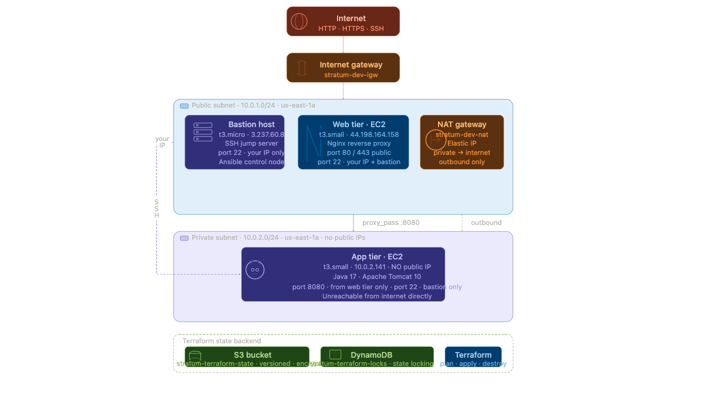

# Stratum

> Stratum is a fully automated multi-tier AWS infrastructure provisioning and configuration, from zero to a running application with a single command.

## What this project does

Stratum provisions a complete, production-style AWS environment entirely from code:

- **Terraform** creates all AWS resources — VPC, subnets, internet gateway, NAT gateway, route tables, security groups, and EC2 instances across three tiers
- **Ansible** configures every server — OS hardening, Nginx reverse proxy on the web tier, Java and Tomcat on the app tier
- **Remote state** stored in S3 with DynamoDB locking — safe for team use

Zero manual console clicks and everything is versioned, repeatable, and idempotent.

## Architecture


## Stack

| Tool | Role |
|------|------|
| Terraform 1.7+ | Infrastructure provisioning |
| Ansible 2.15+ | Configuration management |
| AWS VPC | Network isolation |
| AWS EC2 | Compute — bastion, web, app tiers |
| AWS S3 | Terraform remote state storage |
| AWS DynamoDB | State locking |
| Nginx | Reverse proxy on web tier |
| Tomcat + Java 17 | Application server on app tier |

## Infrastructure layout



## Quick start

```bash
# 1. Provision infrastructure
cd terraform/environments/dev
cp example.tfvars terraform.tfvars
# Edit terraform.tfvars with your values
terraform init
terraform plan
terraform apply

# 2. Generate Ansible inventory
# Update ansible/inventory/hosts with the IPs from terraform output
terraform output

# 3. Configure all servers
cd ../../../ansible
ansible-playbook -i inventory/hosts playbooks/site.yml
```

## Destroy everything

```bash
cd terraform/environments/dev
terraform destroy
```
